<h1 align="center">
  Filter Consistency in IMU–Visual Odometry Fusion
</h1>

<p align="center">
  A Monte Carlo benchmark of seven EKF/UKF variants with adaptive covariance tuning,
  Mahalanobis-gated adaptation, and rigorous NEES/NIS consistency analysis.
</p>

<p align="center">
  <a href="https://arxiv.org/abs/XXXX.XXXXX"></a>
  
  
  
  
</p>

---

## What this is

A complete, reproducible research codebase evaluating seven state estimators
for 2D IMU–visual odometry (VO) sensor fusion:

| Estimator | Type | Adaptation |
|---|---|---|
| **EKF** | Extended Kalman Filter | Fixed Q/R |
| **UKF** | Unscented Kalman Filter | Fixed Q/R |
| **ES-EKF** | Error-State EKF | Fixed Q/R |
| **Adaptive-EKF** | EKF | R-only (Mohamed-Schwarz) |
| **Adaptive-UKF** | UKF | R-only (Mohamed-Schwarz) |
| **MACE-EKF** | EKF | R-only + Mahalanobis gate |
| **MACE-UKF** | UKF | R-only + Mahalanobis gate |

Evaluation covers ATE, RPE, NEES, NIS, and filter consistency (chi-squared bounds)
across 3 trajectory geometries × 3 noise regimes × 5 VO-dropout levels,
totalling **5,080 Monte Carlo simulation runs**.

---

## Key results

### Trajectory: EKF fusion vs IMU-only dead reckoning

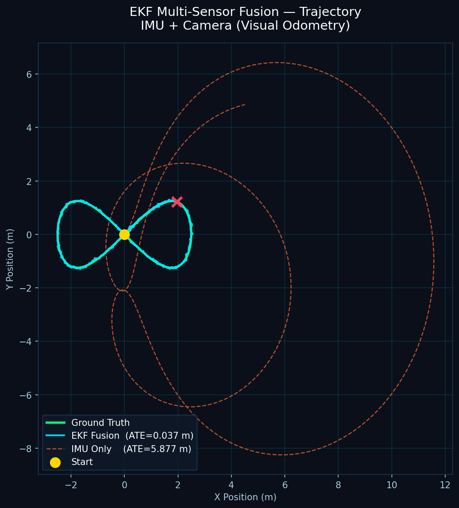

**EKF fusion: ATE = 0.037 m — IMU-only dead reckoning: ATE = 5.877 m (99.4% improvement)**

### Position error and uncertainty convergence

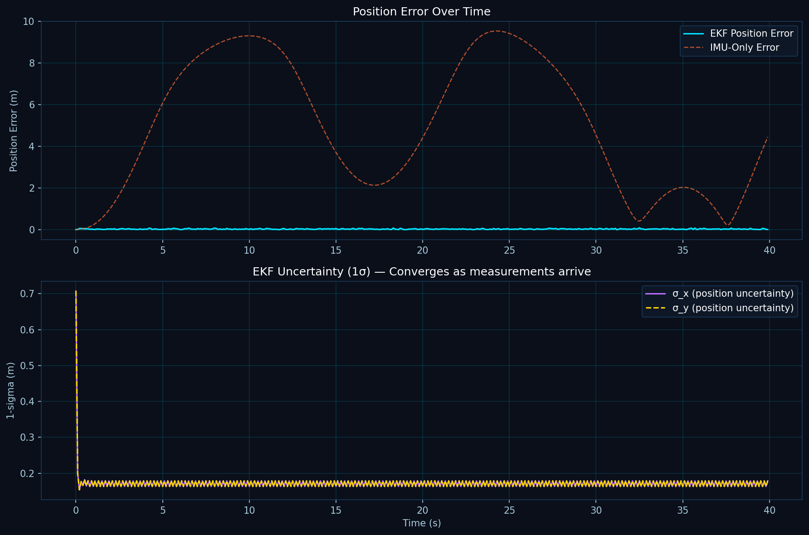

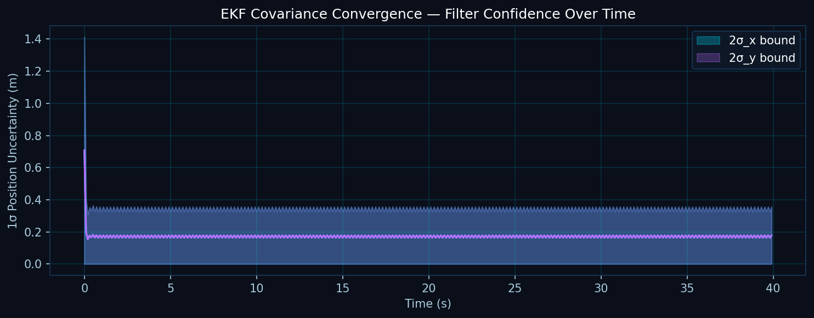

---

## Five findings

**1 — Fixed filters are universally overconfident.**
EKF, UKF, and ES-EKF fail NIS/NEES consistency tests in all 27 standard conditions.
The worst case is 157× below the chi-squared lower bound — systematic, not statistical.

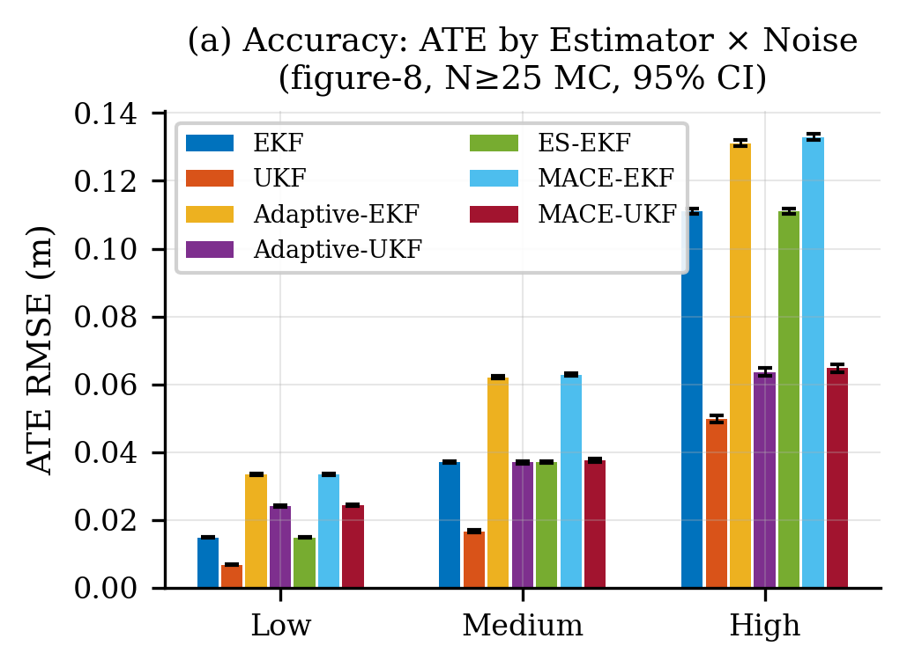

**2 — R-only adaptation restores NIS consistency.**
Adaptive-EKF and Adaptive-UKF achieve ANIS within the 95% chi-squared bounds
at medium and high noise.

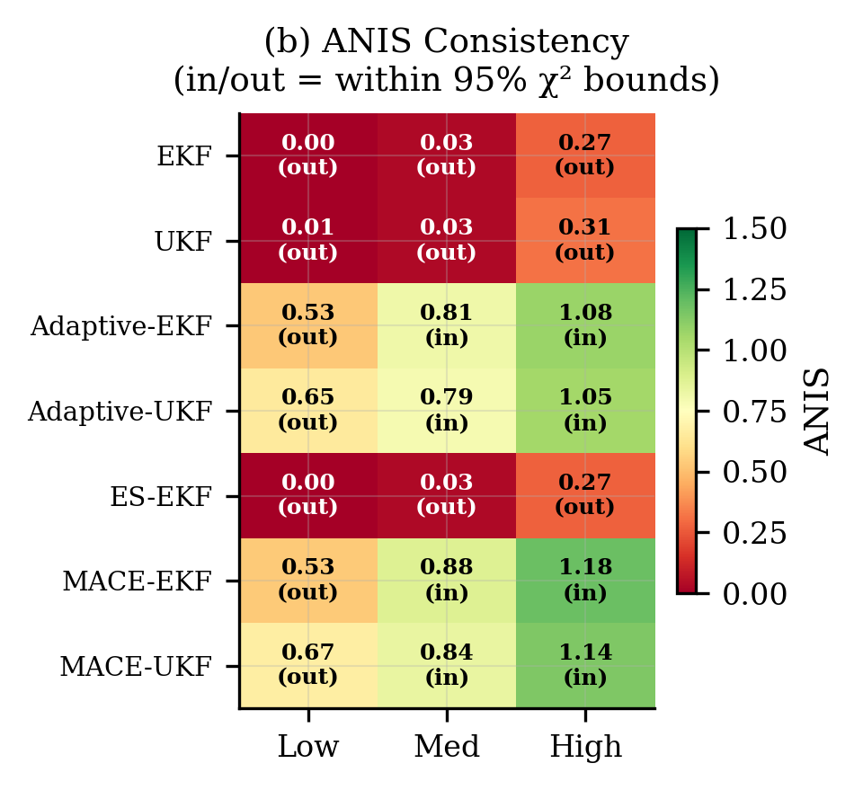

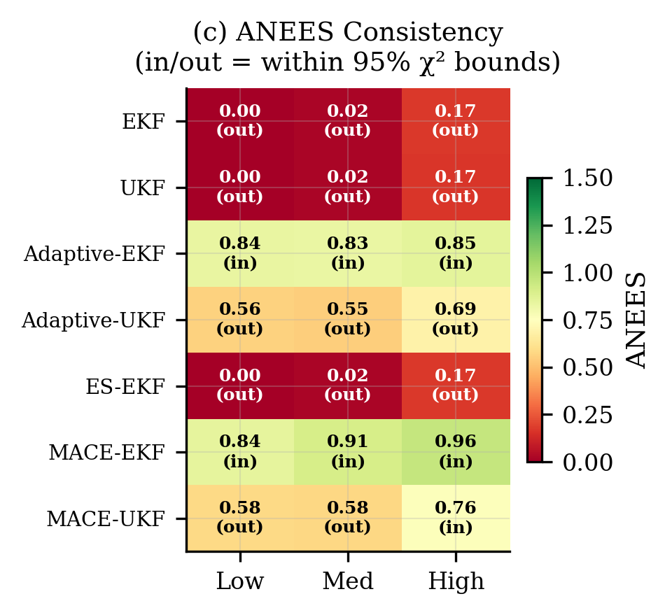

**3 — MACE-EKF is worse than Adaptive-EKF (honest negative result).**
At ≥50% VO dropout, MACE-EKF loses NIS consistency and has higher ATE
than every EKF-family alternative. Chi-squared gating degrades EKF-family adaptation.

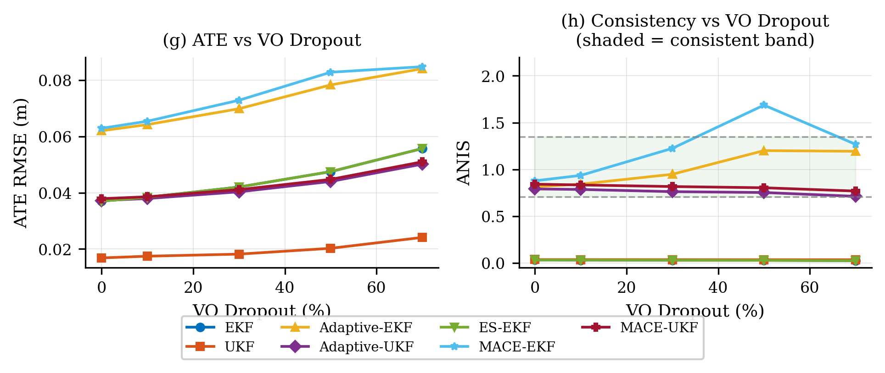

**4 — MACE-UKF extends consistent operation to 70% VO dropout.**
The only estimator maintaining NIS consistency (ANIS = 0.768) at 70% dropout,
where Adaptive-UKF marginally fails (ANIS = 0.711, bound 0.706).

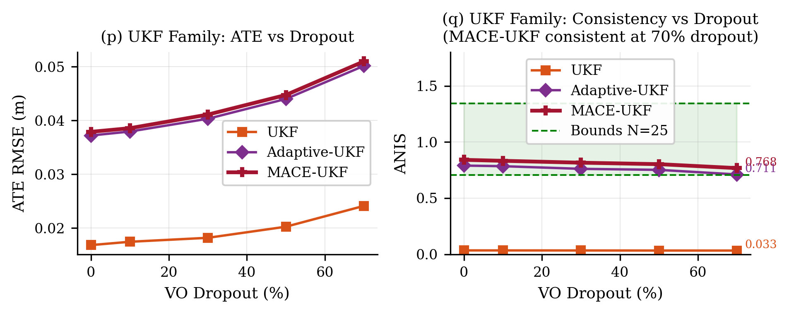

**5 — ES-EKF = EKF in 2D (null result, explicitly documented).**
The error-state advantage is specific to 3D SO(3) kinematics absent in the planar model.

---

## Ablation and sensitivity

### Six-way EKF-family ablation under dropout

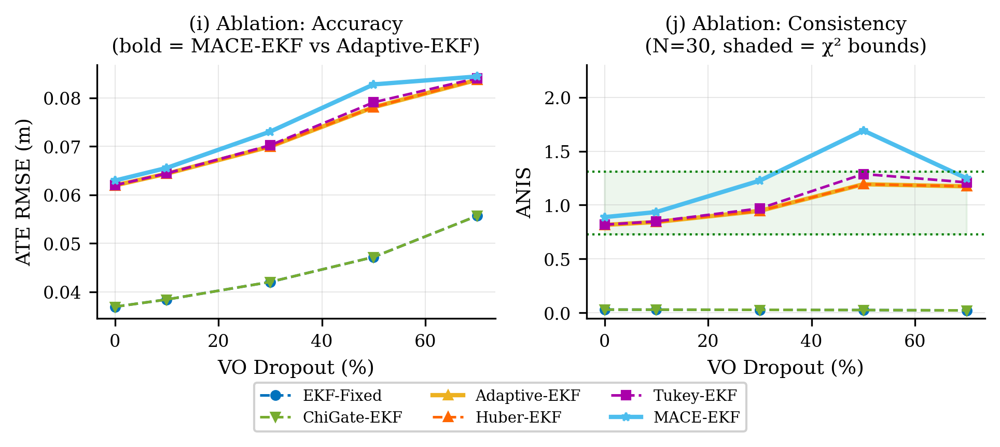

### Chi-squared threshold sensitivity sweep

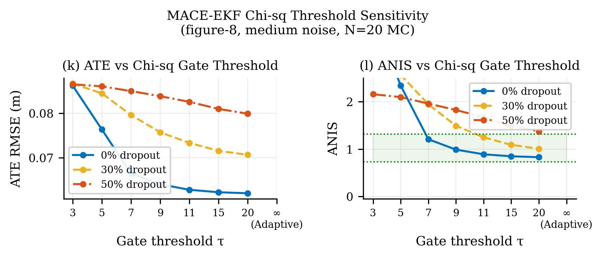

No finite threshold τ simultaneously achieves NIS consistency and lower ATE than Adaptive-EKF.

### Hyperparameter grid (window W × smoothing α)

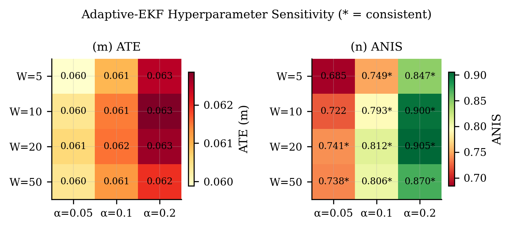

All W ≥ 10, α ≥ 0.05 configurations achieve NIS consistency. Default W=20, α=0.1 is near-Pareto-optimal.

---

## Runtime

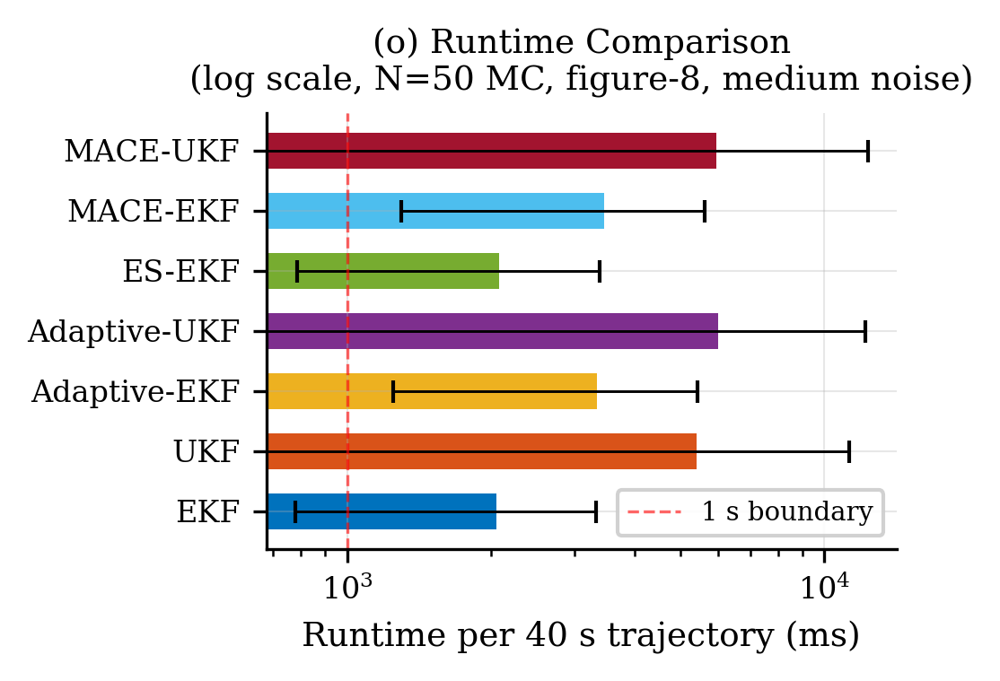

| Estimator | RT (ms / 40 s run) | Real-time margin |
|---|---|---|
| ES-EKF | 122 | >200× |
| EKF | 125 | >200× |
| Adaptive-EKF | 193 | >200× |
| MACE-EKF | 199 | >200× |
| UKF | 699 | >57× |
| MACE-UKF | 790 | >50× |
| Adaptive-UKF | 1013 | >39× |

---

## Trajectory gallery

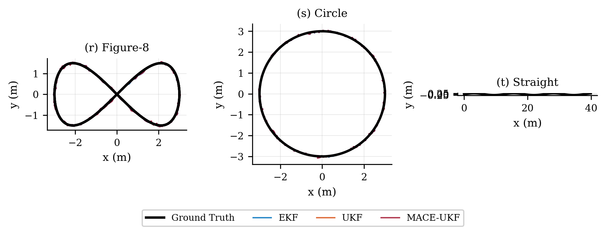

Three trajectories used: figure-8 lemniscate, constant-radius circle, straight-line with transverse wobble.

---

## Quick start

```bash
git clone https://github.com/MedisettiRenukeswar/ekf-multi-sensor-fusion
cd ekf-multi-sensor-fusion
pip install -r requirements.txt

# Run the basic EKF simulation
python run_simulation.py

# Run the full 5,080-run benchmark (takes ~60 min)
bash reproduce_all.sh

# Run tests
python -m pytest tests/ -v
```

---

## Reproduce all paper results

```bash
bash reproduce_all.sh
```

This single command:
1. Installs dependencies
2. Runs 199 unit tests
3. Runs all 5,080 Monte Carlo simulations (parallelised)
4. Generates all 12 publication figures
5. Generates all LaTeX tables

Results land in `results/`, figures in `paper/figures/`.

---

## Repository structure

```
ekf-multi-sensor-fusion/
│
├── ekf_core/                   # All seven estimator implementations
│   ├── estimator_base.py       # Abstract base class (Joseph-form, NEES/NIS)
│   ├── ekf_estimator.py        # Standard EKF
│   ├── ukf_estimator.py        # UKF (Merwe scaled UT, 13 sigma points)
│   ├── esekf_estimator.py      # Error-State EKF
│   ├── adaptive_estimator.py   # Adaptive-EKF and Adaptive-UKF
│   ├── mace_estimator.py       # MACE-EKF and MACE-UKF
│   └── metrics.py              # NEES, NIS, ATE, RPE, chi-squared bounds
│
├── simulation/                 # Sensor simulators
│   ├── sensor_sim.py           # IMU + VO noise model (MPU-6050 parameters)
│   ├── research_sensor_sim.py  # Extended simulator for multi-condition runs
│   └── trajectories.py         # Figure-8, circle, straight-line generators
│
├── benchmark/                  # Experiment runners
│   ├── run_full_benchmark.py   # Standard + dropout benchmark (parallel)
│   ├── run_ablations.py        # Six-way EKF ablation + threshold sweep
│   ├── pub_figures_final.py    # All 12 publication figures
│   └── run_phase6_real_datasets.py  # EuRoC/TUM-VI/KITTI loader (real data)
│
├── datasets/                   # Dataset loaders (real data not included)
│   ├── euroc/euroc_loader.py   # EuRoC MAV IMU+GT loader
│   ├── tumvi/tumvi_loader.py   # TUM-VI loader
│   └── kitti/kitti_loader.py   # KITTI odometry loader
│
├── tests/                      # 199 unit tests
│   ├── test_ekf_original.py    # Original 13 EKF tests
│   ├── test_new_estimators.py  # UKF, ES-EKF, Adaptive, MACE tests
│   └── test_research.py        # Consistency metrics, statistical tests
│
├── paper/
│   ├── main.tex                # Full paper LaTeX source
│   ├── references.bib          # 15 references
│   └── figures/                # 26 publication figures (PNG + PDF)
│
├── results/                    # Pre-computed statistics CSVs + plots
│   ├── n50_stats_standard.csv  # Main benchmark: N=50 per condition
│   ├── n50_stats_dropout.csv   # Dropout benchmark
│   ├── ablation_stats.csv      # Six-way ablation
│   ├── mace_threshold_sweep.csv # Threshold sensitivity
│   └── hyperparam_sensitivity.csv # W × α grid
│
├── run_simulation.py           # Basic single-run demo
├── reproduce_all.sh            # Full reproduction script
└── requirements.txt
```

---

## Real dataset support

Loaders for EuRoC MAV, TUM-VI, and KITTI are implemented under `datasets/`.
Dataset files are not included (download separately):

```bash
# EuRoC MAV (~14 MB IMU+GT only, no images needed)
cd datasets
bash scripts/download_datasets.sh --euroc MH_01_easy V1_01_easy

# Then run with real data
EUROC_ROOT=datasets/data/EuRoC python benchmark/run_phase6_real_datasets.py
```

The benchmark runner auto-detects real vs. synthetic for each sequence.
All results in the paper use **Monte Carlo simulation only**;
real-dataset validation is documented as future work.

---

## Citation

If you use this code or results, please cite:

```bibtex
@article{renukeswar2026filter,
  author  = {Medisetti Renukeswar},
  title   = {Filter Consistency in {IMU}--Visual Odometry Fusion:
             A {Monte Carlo} Evaluation of Seven {EKF/UKF} Variants
             Including an Honest Ablation of {Mahalanobis}-Gated Adaptation},
  journal = {arXiv preprint arXiv:XXXX.XXXXX},
  year    = {2026}
}
```

---

## License

[MIT License](LICENSE) — © 2026 Medisetti Renukeswar

---

<p align="center">
  <a href="mailto:medisettirenukeswar83@gmail.com">medisettirenukeswar83@gmail.com</a>
</p>
